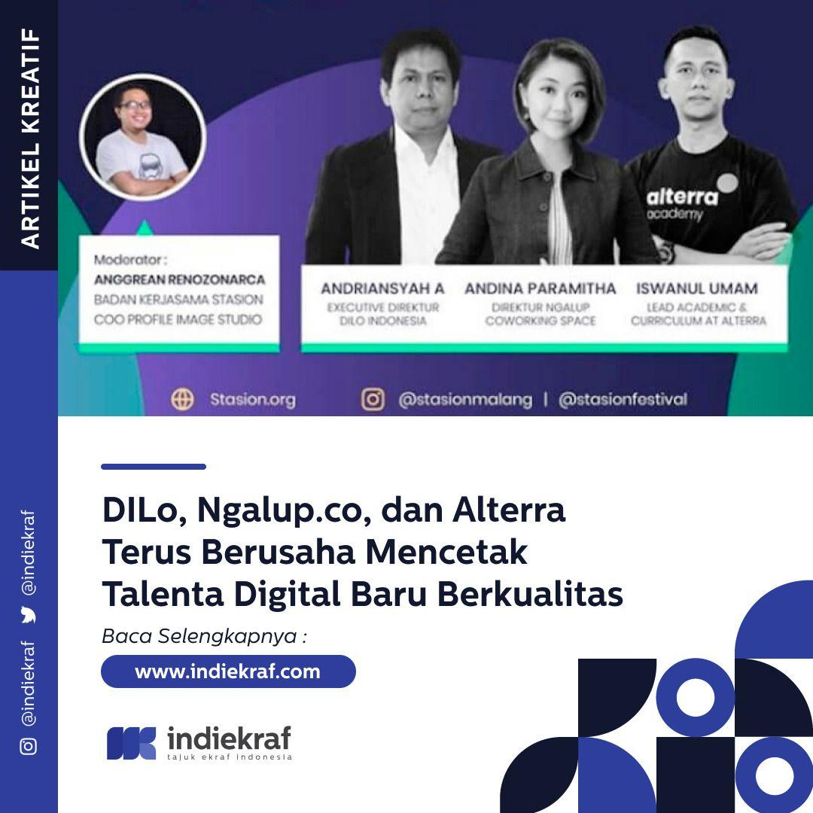
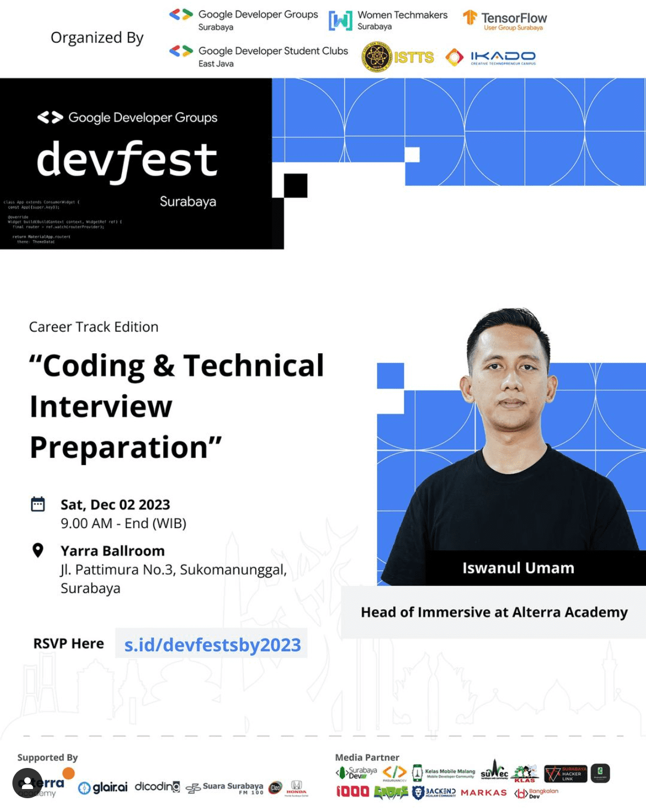
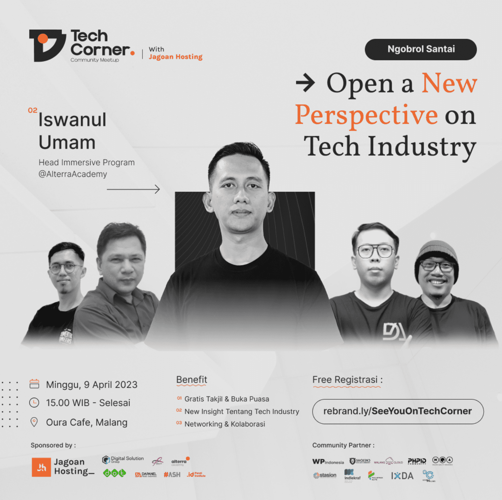

# Iswanul Umam 👋

## I'm a Backend Engineer

- 💻 I enjoy coding and helping others learn to code.
- ❤️ I love technology, coding, software design, and engineering management.
- 🏆 Accomplishment: Helped over 500 junior engineers (backend, frontend, QA, and data engineers) secure jobs in the tech industry.
- ⚡ Motto: _Life is not the art of achieving the possible, but the art of attacking the impossible._

### 💻 Technology Specialization

    
    
    
    
    
    
    
    
    

### 🎓 Volunteering

👋 If you are part of the tech community and are looking for a speaker, feel free to contact me through my social media.

### 📬 Connect With Me

    <a href="https://www.github.com/iswanulumam" target="_blank" rel="noreferrer">
        <picture>
            <source media="(prefers-color-scheme: dark)" srcset="https://raw.githubusercontent.com/danielcranney/readme-generator/main/public/icons/socials/github-dark.svg" />
            <source media="(prefers-color-scheme: light)" srcset="https://raw.githubusercontent.com/danielcranney/readme-generator/main/public/icons/socials/github.svg" />
            
        </picture>
    </a>&nbsp;&nbsp;
    <a href="https://www.linkedin.com/in/iswanulumam" target="_blank" rel="noreferrer">
        <picture>
            <source media="(prefers-color-scheme: dark)" srcset="https://raw.githubusercontent.com/danielcranney/readme-generator/main/public/icons/socials/linkedin-dark.svg" />
            <source media="(prefers-color-scheme: light)" srcset="https://raw.githubusercontent.com/danielcranney/readme-generator/main/public/icons/socials/linkedin.svg" />
            
        </picture>
    </a>&nbsp;&nbsp;
    <a href="https://www.instagram.com/iswanulumam" target="_blank" rel="noreferrer">
        <picture>
            <source media="(prefers-color-scheme: dark)" srcset="https://raw.githubusercontent.com/danielcranney/readme-generator/main/public/icons/socials/instagram-dark.svg" />
            <source media="(prefers-color-scheme: light)" srcset="https://raw.githubusercontent.com/danielcranney/readme-generator/main/public/icons/socials/instagram.svg" />
            
        </picture>
    </a>&nbsp;&nbsp;
    <a href="https://www.x.com/iswanulumam" target="_blank" rel="noreferrer">
        <picture>
            <source media="(prefers-color-scheme: dark)" srcset="https://raw.githubusercontent.com/danielcranney/readme-generator/main/public/icons/socials/twitter-dark.svg" />
            <source media="(prefers-color-scheme: light)" srcset="https://raw.githubusercontent.com/danielcranney/readme-generator/main/public/icons/socials/twitter.svg" />
            
        </picture>
    </a>&nbsp;&nbsp;

---
